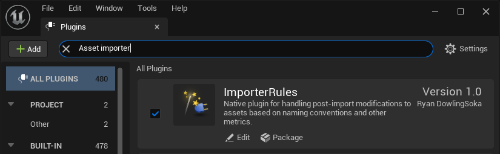
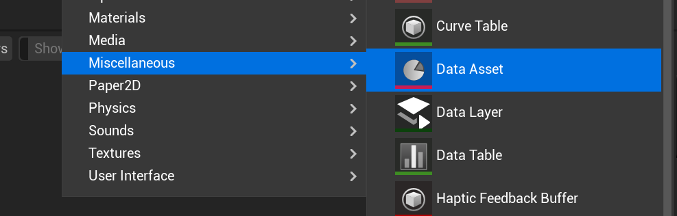
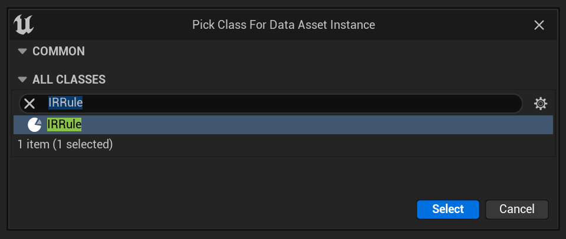
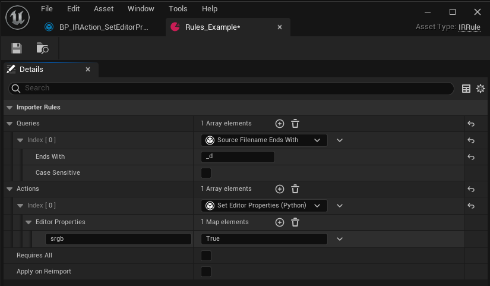
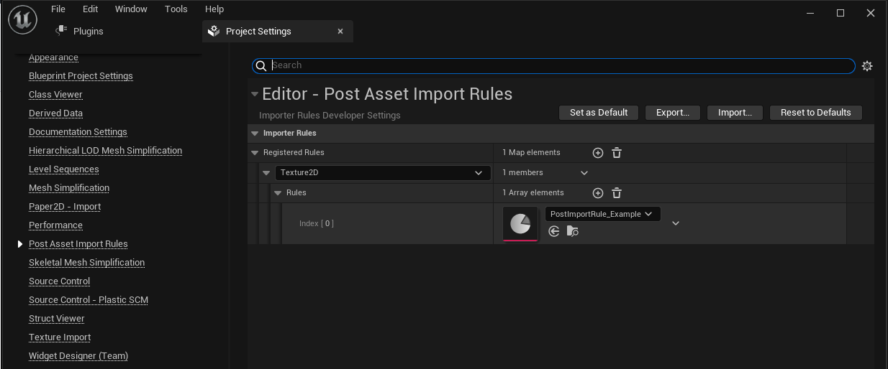

# Asset Importer Rules - Native (CPP/Blueprints) Edition

This repo is an example of how you can use C++ and Blueprints to build an post-import asset pipeline.

## How to use

1. Clone the repo into a plugins folder, preferably at the Project level.
1. Enable the plugin in your `.uproject` file or through the plugin manager in unreal, it is called `Importer Rules`  
   
1. In a content browser folder, right-click Create -> Miscellaneous -> Data Asset  
   
1. In the class picker dialog, search for and pick `IRRule`  
   
1. Open the new IRRule.
1. Add a new Query items and Actions. Such as `Source Ends With` using `_d` as the `Ends With` string and `"srgb":True` as the `Editor Properties` first item to set. This will cause any imported assets that end with _d (before the extension) to have the `sRGB` field turned to `True`.  
    
1. Open Project Settings -> Post Import Asset Rules
1. Add a Rules entry to the `Registered Rules` array, pick the target asset class to apply the rules to.  
   

## Framework breakdown

`Rules` are made out of `Queries` and `Actions`

### Queries

`Queries` are formed from the base type `IRQueryBase` and can be implemented in either C++ or Blueprints. Their purpose is to determine if a given imported asset should have the attached actions applied or not.

To implement a query the `Test(UFactory* Factory, UObject* CreatedObject) -> bool` virtual function must be implemented. Implementing this function in Blueprints is as easy as clicking the override function option, and in C++ the `Test_Implementation` function can be overridden instead. If creating a blueprint query, remember to create the blueprint through the EditorUtilityObject menu, so you have access to all editor only functionality.

These `Queries` should return true or false depending on the various criteria that should trigger the actions in the rule. It is recommended that you override the `DisplayName` name Meta in the C++ class or the Blueprint Class to improve usability.

This example plugin comes with some basic string manipulation queries, they are self-explanatory. The SourcePath "Filename" options check the basename without the extension, and the DestinationPath is looking specifically at the project path of the created objects.

In addition there is a built in action to check the Asset Metadata Tags of a given object, which the system uses to know whether or not the rule's actions have already been applied and if the current import is a reimport or not.

### Actions

`Actions` are formed from the base type `IRActionBase` and can be implemented in either C++ or Blueprints. Their purpose is to apply or transform data on the newly created objects when the attached queries have passed. They can do standard operations like applying particular settings to the objects, or can take external actions like notifying other systems or managers.

To implement an action the `Apply(UFactory* Factory, UObject* CreatedObject) -> bool` virtual function must be implemented. The bool should be whether the action was able to apply. C++ functions should override the `Apply_Implementation` function. If creating a blueprint action, remember to, remember to create the blueprint through the EditorUtilityObject menu, so you have access to all editor only functionality.

This example plugin comes with some basic actions, one for setting asset metadata tags, another for setting generic properties through the python interface, and a final that simply prints a string to the log. Anything available to blueprints can be made into these, and any instance editable blueprint variables will be exposed to the `Rule` data asset.

#### SetEditorProperties

This is the most generic included action, and was implemented in blueprints to show how you can also use blueprints to wrap python code for use in actions. Because it is a wrapper of a generic function in python it isn't the simplest to use, but it is very powerful.

Syntax:

The key should be the 'pythonic' name of the property. This means snake_case and no capital letters, with hungarian notation removed. For example, `sRGB -> srgb` and `bIgnoreCase -> ignore_case`. The key does not need to be wrapped in quotation marks.

The value is an `eval(value)` python string. Boolean values should be `True` or `False` integers and floats can be written with numerics, `0` `1` `3.5` etc. String or Name values should be quoted `"my wonderful value"`.

Arrays of simple types can be written as if they were being put into a python interpreter: `[True, False, True, False]`
Dictionaries can be handled the same. `{"a":True, "b":False}`

Arrays and Dictionaries of complex types should likely be avoided.

This action will fail if the target does not have the given property name or if the value is the wrong type and cannot be coerced.

### Rules

Rules are simple enough, they are just a set of `Queries` and a set of `Actions`. If any/all `Queries` pass then *all* `Actions` are run. If `bRequiresAll` is True, then *all* `Queries` must pass, if False, then a *single* `Query` is enough to cause the actions to run.

## Notes

* There is a python only version of this same pattern available at [https://github.com/Ryan-DowlingSoka/UnrealImporterRules-Python](https://github.com/Ryan-DowlingSoka/UnrealImporterRules-Python)

* This tutorial was made for `#notGDC 2023`! Check out some other great entries at [https://notgdc.io](https://notgdc.io)
